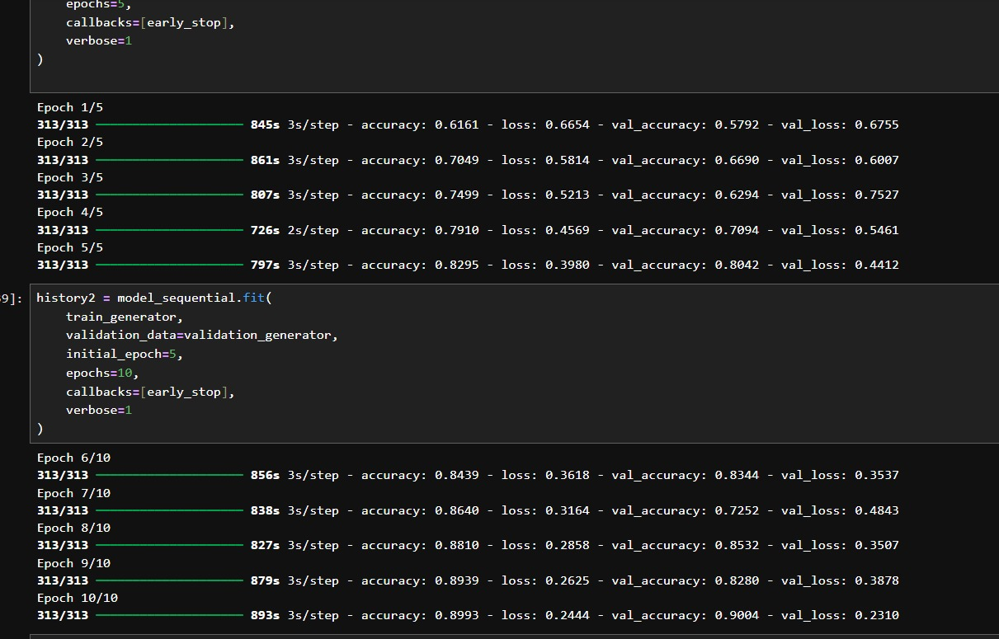
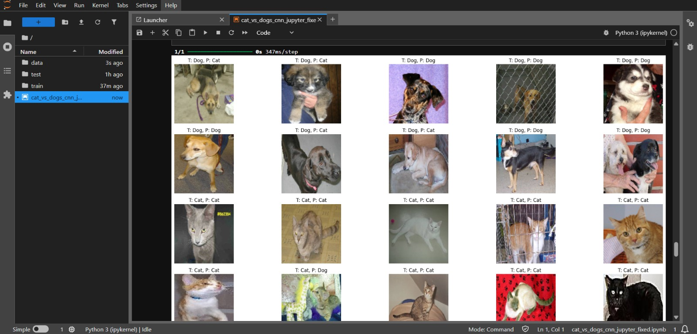
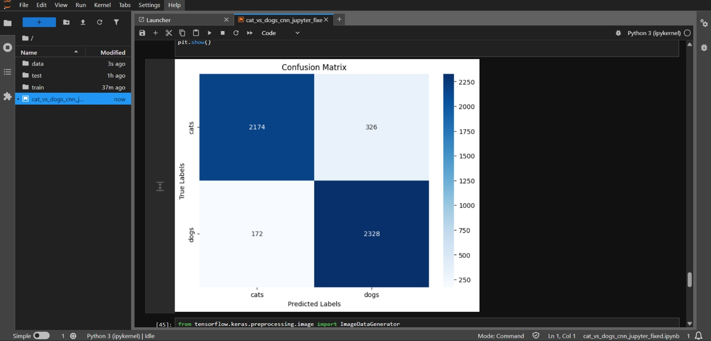
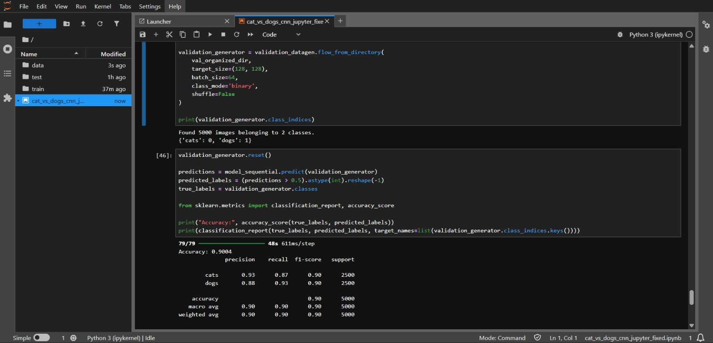

# Cat vs Dogs CNN

This project trains a convolutional neural network (CNN) to classify images of cats and dogs using a Jupyter notebook workflow.

The main work lives in `cat_vs_dogs_cnn_jupyter_fixed.ipynb`, which:

- reads the raw dataset from `train/` and `test/`
- creates a train/validation split inside `data/`
- applies image augmentation and normalization
- trains a custom TensorFlow/Keras CNN
- evaluates the model with accuracy, a classification report, and a confusion matrix

## Project Structure

```text
cnn/
|-- cat_vs_dogs_cnn_jupyter_fixed.ipynb
|-- README.md
|-- train/                # raw training images (cats and dogs mixed)
|-- test/                 # raw test images
|-- data/
|   |-- train/
|   |   |-- cats/
|   |   `-- dogs/
|   `-- validation/
|       |-- cats/
|       `-- dogs/
`-- assets/
    `-- screenshots/
        |-- training-results.jpeg
        |-- sample-predictions.jpeg
        |-- confusion-matrix.jpeg
        `-- classification-report.jpeg
```

## Dataset Layout

Dataset source:

- Kaggle: [Dog VS CAT](https://www.kaggle.com/datasets/ahmedeko/dog-vs-cat)

The notebook expects filenames in the raw `train/` folder to follow the common Kaggle Cats vs Dogs naming style:

- `cat.0.jpg`, `cat.1.jpg`, ...
- `dog.0.jpg`, `dog.1.jpg`, ...

From the current project contents:

- `train/`: 25,000 raw images
- `test/`: 12,500 raw images
- `data/train/`: 20,000 images
- `data/validation/`: 5,000 images

The validation split is created with `train_test_split(..., test_size=0.2, random_state=42)`.

## Model Summary

The notebook builds a custom sequential CNN with:

- 4 convolution blocks
- batch normalization
- max pooling
- global average pooling
- dense layers with dropout
- sigmoid output for binary classification

Training settings used in the notebook:

- optimizer: Adam (`learning_rate=0.001`)
- loss: binary crossentropy
- metric: accuracy
- batch size: `64`
- early stopping on `val_loss`
- training run: 10 epochs total

## Results

The saved notebook output shows:

- validation accuracy: `0.9004`
- validation samples: `5000`

Classification report in the notebook:

```text
              precision    recall  f1-score   support

        cats       0.93      0.87      0.90      2500
        dogs       0.88      0.93      0.90      2500

    accuracy                           0.90      5000
   macro avg       0.90      0.90      0.90      5000
weighted avg       0.90      0.90      0.90      5000
```

## Screenshots

### Training Progress



This screenshot shows the model training across 10 epochs. The validation accuracy improves steadily and finishes at `0.9004`, which matches the final evaluation printed later in the notebook.

### Sample Predictions



This grid shows example validation images with both the true label (`T`) and predicted label (`P`). It gives a quick visual check of where the model is correct and where it still confuses cats and dogs.

### Confusion Matrix



This confusion matrix summarizes prediction counts on the validation set. Most cats and dogs are classified correctly, while the off-diagonal cells show the remaining mistakes between the two classes.

### Classification Report



This screenshot contains the final evaluation metrics, including precision, recall, F1-score, and overall accuracy. It confirms balanced performance across both classes with an overall validation accuracy of about 90%.

## Requirements

Install the project dependencies with:

```bash
pip install -r requirements.txt
```

If you want to download the dataset from Kaggle through the command line, also install the Kaggle CLI:

```bash
pip install kaggle
```

## Dataset Setup

1. Create a Kaggle account and generate your API token from Kaggle account settings.
2. Place `kaggle.json` in the default Kaggle location for your system.
3. Download the dataset:

```bash
kaggle datasets download -d ahmedeko/dog-vs-cat
```

4. Extract the downloaded zip file into the project folder.
5. Make sure the extracted dataset provides the raw image folders used by the notebook:

```text
train/
test/
```

After that, the notebook will create the processed split automatically inside `data/`.

## How To Run

1. Open the project folder.
2. Install the dependencies:

```bash
pip install -r requirements.txt
```

3. Start Jupyter:

```bash
jupyter notebook
```

4. Open `cat_vs_dogs_cnn_jupyter_fixed.ipynb`.
5. Run the cells from top to bottom.

The notebook will:

- organize the raw images into `data/train/` and `data/validation/`
- train the CNN
- plot loss and accuracy curves
- visualize sample predictions
- generate a confusion matrix and classification report

## Notes

- The `data/` folder is recreated by the notebook, so rerunning the data-preparation cells will overwrite the organized split.
- If you edit the notebook, keep the preprocessing image size and model input size aligned.
- The result screenshots are stored in `assets/screenshots/` and embedded directly in this README.
